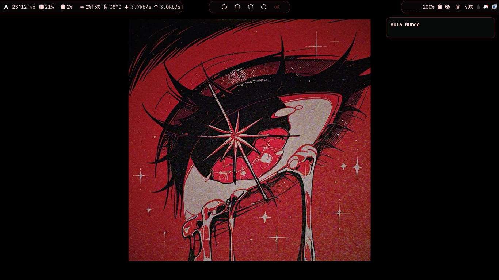
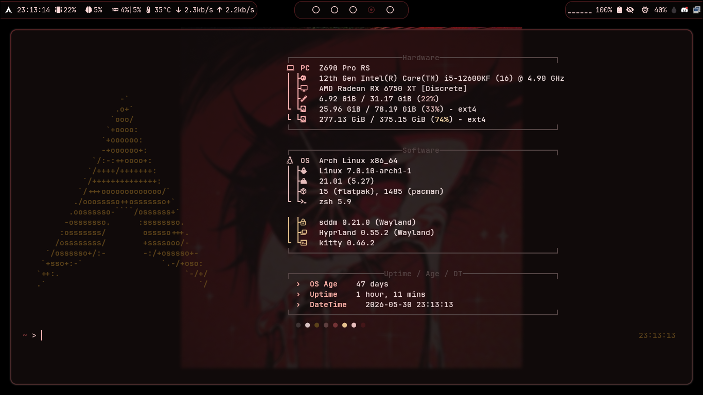
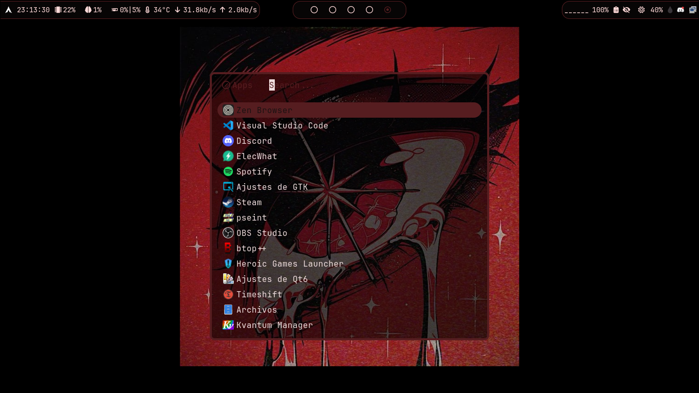
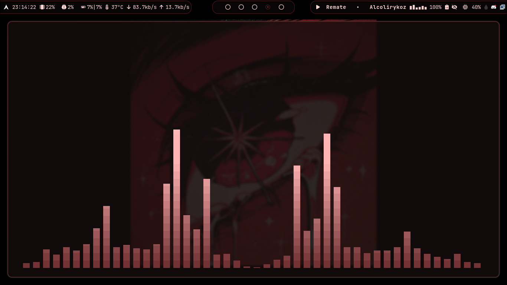
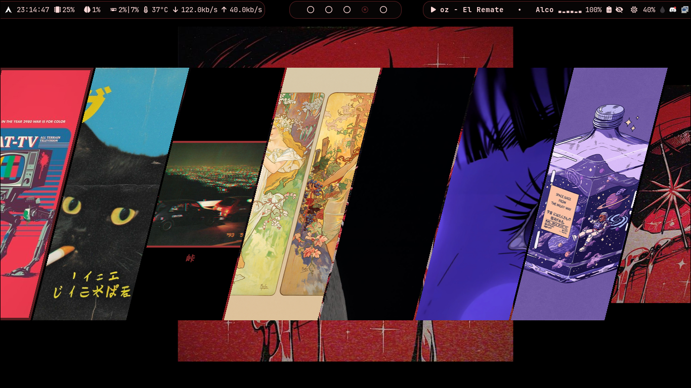
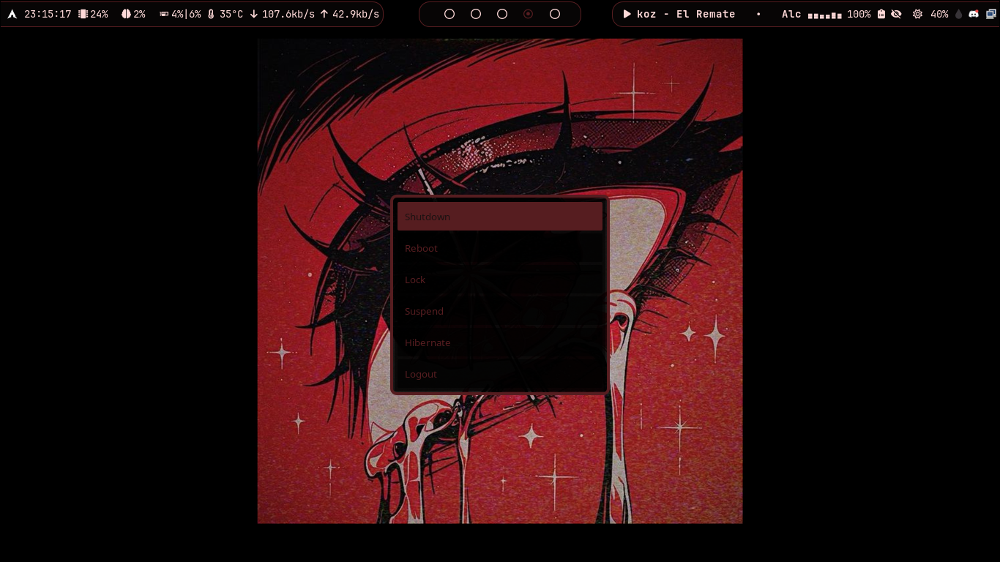

# Hypr-CristOS

Dotfiles personales para Hyprland y Waybar con integración de `Matugen` y `Quickshell`.

## Características

- Configuración lista para Hyprland
- Módulos personalizados para Waybar
- Temas generados automáticamente con `Matugen`
- Selector de wallpaper integrado con `hyprquickpaper`

## Capturas













## Herramientas principales

### Matugen

Genera temas y configuraciones sincronizadas automáticamente desde plantillas.

Componentes sincronizados:
- Hyprland (`hyprland.lua`)
- Waybar (`colors.css`)
- Kitty, Rofi, btop, Fastfetch
- Quickshell (para hyprquickpaper)
- Visual Studio Code (use el tema Name: [Matugen Theme](https://github.com/cristobal-rojas/matugen-vscode-theme))
- Discord Theme (para BetterDiscord (funciona con otros clientes))

Ubicación: `Dotsfile/.config/matugen/config.toml`

### hyprquickpaper (Quickshell)

Selector visual de wallpapers integrado en Hyprland.

**Característica:** Genera automáticamente miniaturas de imágenes y videos, extrae frames con `ffmpeg` y sincroniza colores con `matugen`.

**Cómo usar:**
- `Super + W` → abre el selector `quickshell -c hyprquickpaper`

Ubicación: `Dotsfile/.config/quickshell/hyprquickpaper/`

## Dependencias

### Hyprland (pacman)

```
pacman -S hyprland hypridle hyprlock hyprpicker hyprshot hyprshutdown hyprsunset
```

**Más:** Cursores dinámicos con hyprpm
```
hyprpm add https://github.com/virtcode/hypr-dynamic-cursors
hyprpm enable dynamic-cursors
```

### Waybar (yay)

```
yay -S ttf-arphic-extra ttf-jetbrains-mono-git waybar-git waybar-module-pacman-updates-git wttrbar
```

**Más:** GPU usage plugin (cargo)
```
cargo install gpu-usage-waybar
```

### hyprquickpaper (Quickshell)

```
yay -S quickshell ffmpeg mpvpaper awww
```
### Rofi 

```
pacman -S rofi clipshit
```
## Créditos

- **Rofi themes:** https://github.com/zhaleff/BlackNode/tree/master
- **hyprquickpaper:** https://github.com/iamsurjog/hyprquickpaper
- **BreezeX theme for hyprcursor:** Njobe
